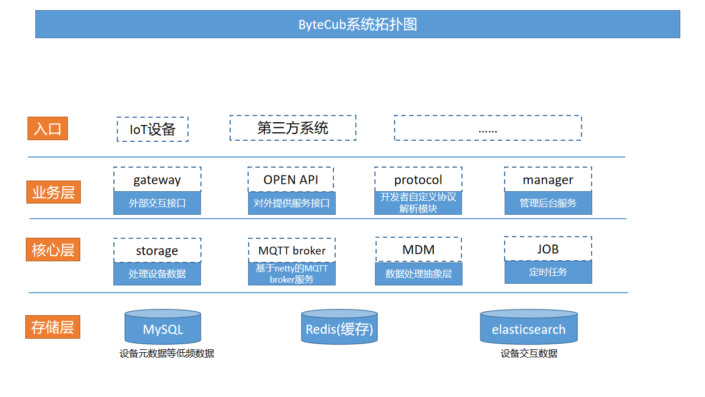
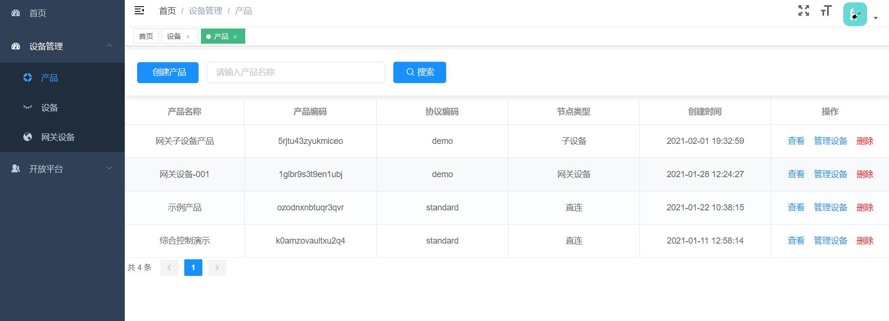
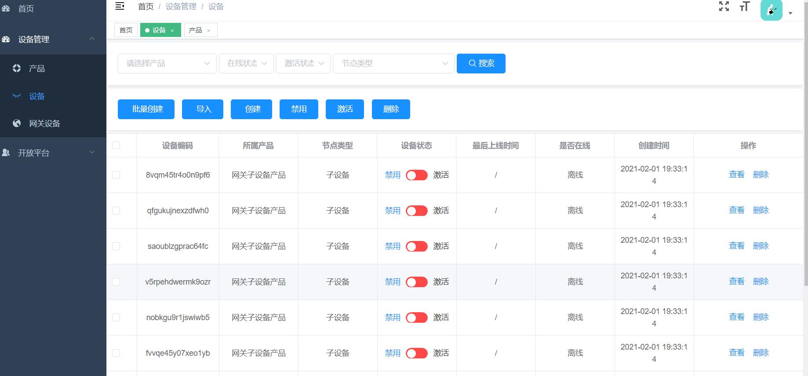
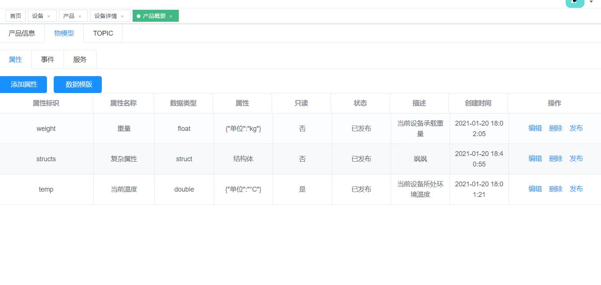

# ByteCub IoT platform
#### 更新说明
最新代码在码云,github只是最初版本.   
码云地址: [https://gitee.com/byte-cub/bytecub](https://gitee.com/byte-cub/bytecub)
#### 文档地址
 [https://docs.qq.com/doc/DQU9qaGx0UlZhQWhS](https://docs.qq.com/doc/DQU9qaGx0UlZhQWhS)
#### PC WEB管理后台地址
~~管理后台: [demo.bytecub.cn](http://demo.bytecub.cn)    
演示帐号: demo/123456~~    
演示服务器无资金续费已经停了

#### 前端代码地址
前端代码地址: [https://gitee.com/byte-cub/bytecub-manager-ui](https://gitee.com/byte-cub/bytecub-manager-ui)
#### 提供能力  
##### 1.MQTT通讯能力  
######  SSL支持 
######  retain&will 消息(集群化暂不支持) 
##### 2.集群化部署  
###### 和单例部署一样简单，只需要通过nginx/LVS等进行负载均衡配置即可
##### 3.自定义物模型  
##### 4.自定义数据协议  
###### 只需要一行注解，就可以实现自定义数据协议。具体可查看文档   
##### 5.自定义开发平台  
###### 可根据自己项目需求，很简便安全的通过http接口向业务系统提供支持能力  

#### 压测结果 
使用阿里云2核4G，单机部署情况下支持每秒5K条消息上报，数据无积压，cpu负载最高40%
### 联系方式   
  
扫描二维码，加好友进交流群

### 软件架构

### 安装教程
外部依赖:
1.  MySQL 5.6/5.7
2.  ElasticSearch 7.6.2
3.  Redis 4.0+

docker compose脚本位于 **.docker\dev-env\docker-compose.yml**，通过 **cd** 命令进入该目录后，执行 **docker-compose up -d** 
实现一键搭建开发环境。  
#### 数据库:  
docs/db 目录下，执行sql文件，初始帐号密码admin/123456。 
<pre>
密码生成格式: 原始字符串MD5 -> 然后转大写 -> 二次MD5
</pre>

### 启动:  
  本项目为标准springboot项目
  1. idea启动  
  启动bytecub-application module下的ByteCubApplication主类即可
  2. jar包启动  
  执行 mvn install，运行
  <pre>
  nohup java -jar /home/apps/server/bytecub/bytecub-application-1.0-SNAPSHOT.jar --spring.profiles.active=prod >/dev/null 2>log &
  </pre>
### 使用说明

请移步至 [https://docs.qq.com/doc/DQU9qaGx0UlZhQWhS](https://docs.qq.com/doc/DQU9qaGx0UlZhQWhS)

### 部分截图

